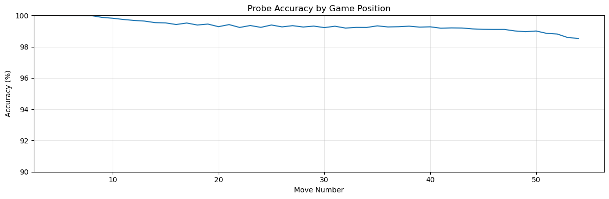
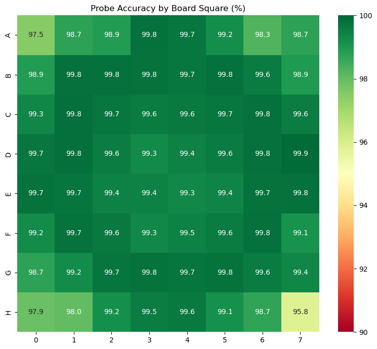
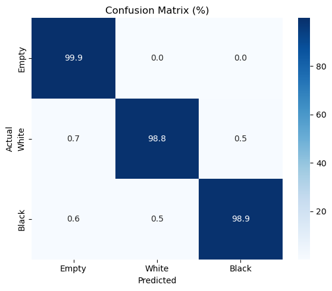
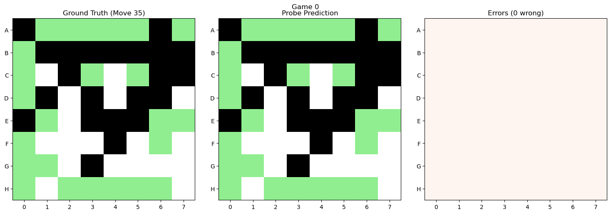
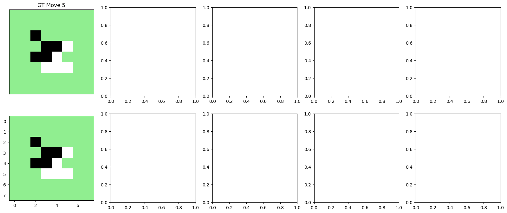
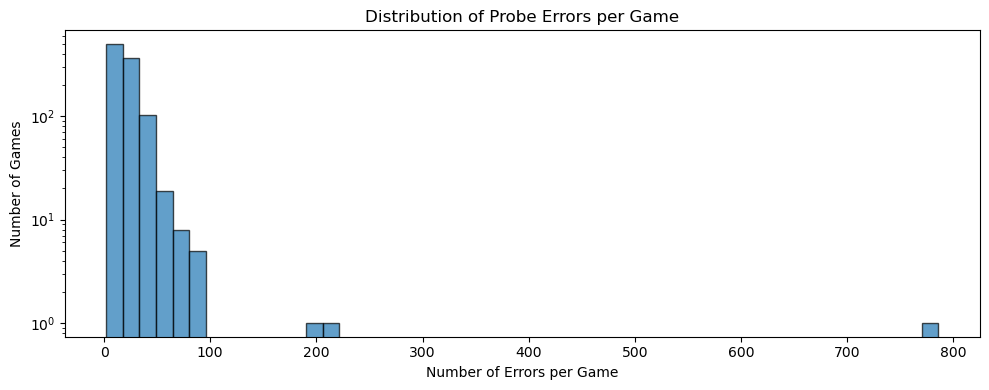
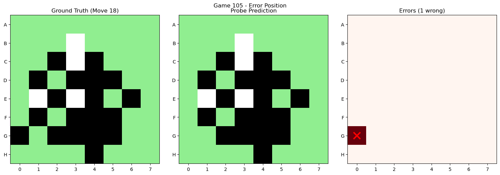
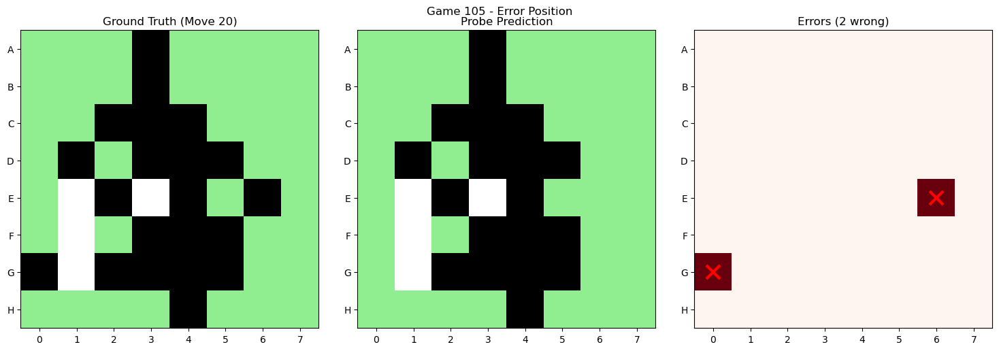
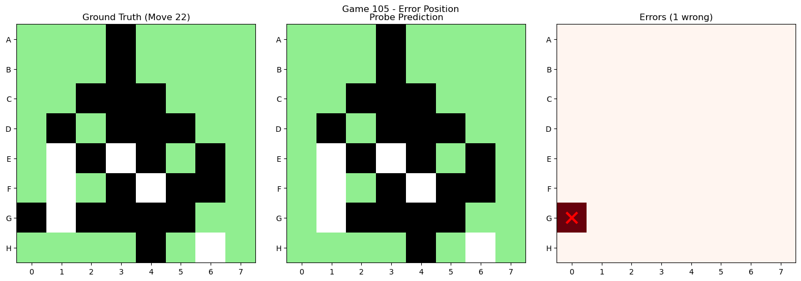

# Linear Probe for Board State Recovery

This notebook trains and evaluates linear probes that recover the Othello board state
from GPT activations. Based on Neel Nanda's mechanistic interpretability work.

## Key Concepts

**Linear Probe**: A simple linear classifier that takes model activations as input
and predicts the board state. If a linear probe achieves high accuracy, it suggests
the model represents board state as **linear directions** in activation space.

**Board State Encoding**:
- 0 = Empty square
- 1 = White piece  
- 2 = Black piece

The probe predicts one of these 3 classes for each of the 64 board squares.

## Sections
1. Setup & Data Loading
2. Load or Train Linear Probe
3. Evaluate Probe Accuracy
4. Visualize Predictions vs Ground Truth
5. Error Analysis


```python
%load_ext autoreload
%autoreload 2
```

## 1. Setup & Data Loading


```python
import os
import sys

# Find project root
def find_project_root():
    candidates = [
        os.getcwd(),
        os.path.dirname(os.getcwd()),
        os.path.expanduser("~/phil_proj/nothello_world"),
    ]
    for path in candidates:
        if os.path.exists(os.path.join(path, "mechanistic_interpretability")):
            return path
    raise RuntimeError("Could not find project root.")

PROJECT_ROOT = find_project_root()
os.chdir(PROJECT_ROOT)
sys.path.insert(0, PROJECT_ROOT)
print(f"Project root: {PROJECT_ROOT}")
```

    Project root: /Users/teo/phil_proj/nothello_world


```python
import torch
import numpy as np
from tqdm.notebook import tqdm
import matplotlib.pyplot as plt
import seaborn as sns

# Import local mingpt model
from mingpt.model import GPT, GPTConfig, GPTforProbing
from mingpt.dataset import CharDataset
from data import get_othello

# Try importing TransformerLens (optional)
try:
    from transformer_lens import HookedTransformer, HookedTransformerConfig
    import transformer_lens.utils as tl_utils
    TRANSFORMERLENS_AVAILABLE = True
except ImportError:
    TRANSFORMERLENS_AVAILABLE = False
    print("TransformerLens not available - will use local mingpt only")

# Import utilities from mechanistic_interpretability
sys.path.insert(0, os.path.join(PROJECT_ROOT, "mechanistic_interpretability"))
from mech_interp_othello_utils import (
    OthelloBoardState, 
    permit_reverse,
    alpha,
)

# Check for GPU
device = torch.device("cuda" if torch.cuda.is_available() else "cpu")
print(f"Using device: {device}")
```

    Using device: cpu


```python
# === CONFIGURATION ===

# Backend: "transformerlens" or "mingpt"
# - transformerlens: Downloads model from HuggingFace, uses HookedTransformer
# - mingpt: Uses local checkpoint from ckpts/
BACKEND = "transformerlens"  # Change to "transformerlens" to use HuggingFace model

# Which model checkpoint to use: "synthetic" or "championship"
CHECKPOINT = "synthetic"

# Probe layer - which transformer layer to probe (0-7)
PROBE_LAYER = 6

# Training configuration
TRAIN_NEW_PROBE = True  # Set False to load existing probe
NUM_TRAINING_GAMES = 100000  # Number of games for training (Nanda uses 100k)
NUM_EPOCHS = 2
BATCH_SIZE = 64
LEARNING_RATE = 1e-4
WEIGHT_DECAY = 0.01

# Evaluation
NUM_EVAL_GAMES = 1000  # Number of games for evaluation

# Position range (avoid first/last few moves which can be anomalous)
POS_START = 5
POS_END = 55  # ~59 moves per game, leave buffer

# Validate configuration
if BACKEND == "transformerlens" and not TRANSFORMERLENS_AVAILABLE:
    print("WARNING: TransformerLens not available, falling back to mingpt")
    BACKEND = "mingpt"
    
print(f"Backend: {BACKEND}")
print(f"Checkpoint: {CHECKPOINT}")
```

    Backend: transformerlens
    Checkpoint: synthetic


### Load Othello-GPT Model (TransformerLens)


```python
# Load dataset (needed for both backends)
othello = get_othello(ood_num=-1, data_root=None, wthor=True)
char_dataset = CharDataset(othello)

if BACKEND == "transformerlens":
    # Configure TransformerLens model
    cfg = HookedTransformerConfig(
        n_layers=8,
        d_model=512,
        d_head=64,
        n_heads=8,
        d_mlp=2048,
        d_vocab=61,
        n_ctx=59,
        act_fn="gelu",
        normalization_type="LNPre",
    )
    model = HookedTransformer(cfg)
    
    # Download weights from HuggingFace
    print(f"Downloading {CHECKPOINT} model from HuggingFace...")
    model_file = f"{CHECKPOINT}_model.pth"
    sd = tl_utils.download_file_from_hf("NeelNanda/Othello-GPT-Transformer-Lens", model_file)
    model.load_state_dict(sd)
    model = model.to(device)
    
    D_MODEL = model.cfg.d_model
    print(f"TransformerLens model loaded: {model.cfg.n_layers} layers, {D_MODEL} dims")
    
else:  # mingpt
    # Configure mingpt model
    mconf = GPTConfig(
        char_dataset.vocab_size, 
        char_dataset.block_size,
        n_layer=8, 
        n_head=8, 
        n_embd=512
    )
    model = GPTforProbing(mconf, probe_layer=PROBE_LAYER)
    
    # Load local checkpoint
    ckpt_path = os.path.join(PROJECT_ROOT, "ckpts", f"gpt_{CHECKPOINT}.ckpt")
    print(f"Loading checkpoint: {ckpt_path}")
    model.load_state_dict(torch.load(ckpt_path, map_location=device, weights_only=False))
    model = model.to(device)
    
    D_MODEL = mconf.n_embd
    print(f"mingpt model loaded: {mconf.n_layer} layers, {D_MODEL} dims, probing layer {PROBE_LAYER}")

model.eval()
```

      0%|          | 0/238 [00:00<?, ?it/s]

    Mem Used: 11.68 GB: 100%|██████████| 238/238 [00:21<00:00, 10.97it/s]


    Deduplicating...
    Deduplicating finished with 23796010 games left
    Using 20 million for training, 3796010 for validation
    Dataset created has 20000000 sequences, 61 unique words.
    Downloading synthetic model from HuggingFace...
    Moving model to device:  cpu
    TransformerLens model loaded: 8 layers, 512 dims


    HookedTransformer(
      (embed): Embed()
      (hook_embed): HookPoint()
      (pos_embed): PosEmbed()
      (hook_pos_embed): HookPoint()
      (blocks): ModuleList(
        (0-7): 8 x TransformerBlock(
          (ln1): LayerNormPre(
            (hook_scale): HookPoint()
            (hook_normalized): HookPoint()
          )
          (ln2): LayerNormPre(
            (hook_scale): HookPoint()
            (hook_normalized): HookPoint()
          )
          (attn): Attention(
            (hook_k): HookPoint()
            (hook_q): HookPoint()
            (hook_v): HookPoint()
            (hook_z): HookPoint()
            (hook_attn_scores): HookPoint()
            (hook_pattern): HookPoint()
            (hook_result): HookPoint()
          )
          (mlp): MLP(
            (hook_pre): HookPoint()
            (hook_post): HookPoint()
          )
          (hook_attn_in): HookPoint()
          (hook_q_input): HookPoint()
          (hook_k_input): HookPoint()
          (hook_v_input): HookPoint()
          (hook_mlp_in): HookPoint()
          (hook_attn_out): HookPoint()
          (hook_mlp_out): HookPoint()
          (hook_resid_pre): HookPoint()
          (hook_resid_mid): HookPoint()
          (hook_resid_post): HookPoint()
        )
      )
      (ln_final): LayerNormPre(
        (hook_scale): HookPoint()
        (hook_normalized): HookPoint()
      )
      (unembed): Unembed()
    )


### Load Game Data


```python
# Use games from the loaded dataset
games = othello.val if hasattr(othello, 'val') and othello.val else othello.sequences

# Filter to games with enough moves
valid_games = [g for g in games if len(g) >= POS_END]

print(f"Loaded {len(games)} total games, {len(valid_games)} with >= {POS_END} moves")
print(f"Example game length: {len(games[0])} moves")
```

    Loaded 3796010 total games, 3794544 with >= 55 moves
    Example game length: 60 moves


### Helper Functions


```python
def seq_to_state_stack(moves):
    """
    Convert a sequence of moves to a stack of board states.
    
    Args:
        moves: List of move integers (0-63 board positions)
        
    Returns:
        numpy array of shape (num_moves, 8, 8) with values:
        -1 = white, 0 = empty, 1 = black
    """
    if isinstance(moves, torch.Tensor):
        moves = moves.tolist()
    board = OthelloBoardState()
    states = []
    for move in moves:
        board.umpire(move)
        states.append(np.copy(board.state))
    states = np.stack(states, axis=0)
    return states


def state_stack_to_one_hot(state_stack):
    """
    Convert state stack to one-hot encoding.
    """
    one_hot = torch.zeros(
        state_stack.shape[0],
        state_stack.shape[1],
        8, 8, 3,
        device=state_stack.device,
        dtype=torch.float,
    )
    one_hot[..., 0] = state_stack == 0   # empty
    one_hot[..., 1] = state_stack == -1  # white
    one_hot[..., 2] = state_stack == 1   # black
    return one_hot


def get_ground_truth_states(game_list, pos_start, pos_end):
    """
    Compute ground truth board states for a batch of games.
    
    Returns:
        state_stack: tensor of shape (batch, length, 8, 8)
    """
    batch_states = []
    length = pos_end - pos_start
    for game in game_list:
        states = seq_to_state_stack(game)
        end = min(pos_end, len(states))
        if end > pos_start:
            sliced = states[pos_start:end]
            if len(sliced) < length:
                pad_size = length - len(sliced)
                sliced = np.concatenate([sliced, np.zeros((pad_size, 8, 8))], axis=0)
            batch_states.append(sliced)
    return torch.tensor(np.stack(batch_states, axis=0))


def games_to_input_tensor_mingpt(game_list, stoi):
    """Convert games to input tensor for mingpt."""
    max_len = max(len(g) for g in game_list)
    batch = torch.zeros((len(game_list), max_len), dtype=torch.long)
    for i, game in enumerate(game_list):
        tokens = [stoi[move] for move in game]
        batch[i, :len(tokens)] = torch.tensor(tokens)
    return batch


def games_to_input_tensor_tl(game_list):
    """Convert games to input tensor for TransformerLens (int encoding)."""
    max_len = max(len(g) for g in game_list)
    batch = torch.zeros((len(game_list), max_len), dtype=torch.long)
    for i, game in enumerate(game_list):
        for j, move in enumerate(game):
            # TransformerLens int encoding: adjust for middle squares
            if move < 27:
                batch[i, j] = move + 1
            elif move < 35:
                batch[i, j] = move - 1
            else:
                batch[i, j] = move - 3
    return batch


@torch.no_grad()
def get_activations(model, game_list, pos_start, pos_end, backend, stoi=None, layer=None):
    """
    Unified activation extraction for both backends.
    
    Returns:
        activations: tensor of shape (batch, length, d_model)
    """
    if backend == "transformerlens":
        input_tensor = games_to_input_tensor_tl(game_list).to(device)
        # Run with cache to get intermediate activations
        _, cache = model.run_with_cache(input_tensor[:, :-1], return_type=None)
        activations = cache["resid_post", layer][:, pos_start:pos_end]
    else:  # mingpt
        input_tensor = games_to_input_tensor_mingpt(game_list, stoi).to(device)
        activations = model(input_tensor)[:, pos_start:pos_end, :]
    
    return activations
```

<cell_type>markdown</cell_type>## 2. Load or Train Linear Probe

The probe is a tensor of shape `(modes, d_model, rows, cols, options)`:
- **modes** = 3: 
  - Mode 0: trained on even positions (black's turn)
  - Mode 1: trained on odd positions (white's turn)
  - Mode 2: trained on all positions
- **d_model** = 512: model hidden dimension
- **rows, cols** = 8, 8: board dimensions
- **options** = 3: empty, white, black

This multi-mode approach follows Neel Nanda's implementation, accounting for the
alternating player turns in Othello. The model may encode "current player" vs
"opponent" rather than absolute black/white, so separate probes per turn help.


```python
# Probe dimensions (following Nanda's approach)
MODES = 3  # even positions, odd positions, all positions
ROWS = 8
COLS = 8
OPTIONS = 3  # empty, white, black

# Probe path includes backend to avoid mixing probes
probe_path = os.path.join(PROJECT_ROOT, "ckpts", f"probe_{BACKEND}_layer{PROBE_LAYER}_{CHECKPOINT}_3mode.pth")
print(f"Probe will be saved to: {probe_path}")
print(f"Probe shape: ({MODES}, {D_MODEL}, {ROWS}, {COLS}, {OPTIONS})")
```

    Probe will be saved to: /Users/teo/phil_proj/nothello_world/ckpts/probe_transformerlens_layer6_synthetic_3mode.pth
    Probe shape: (3, 512, 8, 8, 3)


```python
if TRAIN_NEW_PROBE:
    print(f"Training new 3-mode probe for {BACKEND} backend...")
    print("Mode 0: relative-even positions (0::2)")
    print("Mode 1: relative-odd positions (1::2)")
    print("Mode 2: all positions")
    
    # 3-mode probe following Nanda's architecture
    # Shape: (modes, d_model, rows, cols, options)
    linear_probe = torch.nn.Parameter(
        torch.randn(MODES, D_MODEL, ROWS, COLS, OPTIONS, device=device) / np.sqrt(D_MODEL)
    )
    
    optimizer = torch.optim.AdamW(
        [linear_probe], 
        lr=LEARNING_RATE, 
        betas=(0.9, 0.99), 
        weight_decay=WEIGHT_DECAY
    )
    
    train_games = valid_games[:NUM_TRAINING_GAMES]
    print(f"Using {len(train_games)} games for training")
    
    length = POS_END - POS_START
    stoi = char_dataset.stoi
    
    for epoch in range(NUM_EPOCHS):
        indices = torch.randperm(len(train_games))
        epoch_losses = {'even': 0.0, 'odd': 0.0, 'all': 0.0, 'total': 0.0}
        num_batches = 0
        
        for i in tqdm(range(0, len(train_games), BATCH_SIZE), desc=f"Epoch {epoch+1}"):
            batch_indices = indices[i:i+BATCH_SIZE]
            batch_games = [train_games[j] for j in batch_indices]
            
            # Get ground truth states
            state_stack = get_ground_truth_states(batch_games, POS_START, POS_END).to(device)
            
            # Build one-hot targets: (modes, batch, length, 8, 8, 3)
            # Following Nanda's state_stack_to_one_hot exactly
            state_stack_one_hot = torch.zeros(
                MODES, state_stack.shape[0], state_stack.shape[1],
                ROWS, COLS, OPTIONS, device=device, dtype=torch.float,
            )
            state_stack_one_hot[:, ..., 0] = (state_stack == 0).float()   # empty
            state_stack_one_hot[:, ..., 1] = (state_stack == -1).float()  # white
            state_stack_one_hot[:, ..., 2] = (state_stack == 1).float()   # black
            
            # Get activations: (batch, length, d_model)
            activations = get_activations(
                model, batch_games, POS_START, POS_END, 
                BACKEND, stoi=stoi, layer=PROBE_LAYER
            )
            
            batch_size_actual = activations.shape[0]
            seq_len = activations.shape[1]
            
            # Apply probe via einsum matching Nanda's fancy_einsum:
            #   "batch pos d_model, modes d_model rows cols options
            #    -> modes batch pos rows cols options"
            probe_out = torch.einsum(
                'bpd,mdrco->mbprco',
                activations,
                linear_probe,
            )
            
            # Compute log probabilities
            probe_log_probs = probe_out.log_softmax(-1)
            
            # Nanda's loss: einops.reduce(log_probs * one_hot,
            #   "modes batch pos rows cols options -> modes pos rows cols", "mean") * options
            # This means: mean over batch AND options, then * options to undo options avg.
            # Since one_hot has exactly 1 non-zero per options dim,
            # mean-over-options * options = sum-over-options.
            probe_correct_log_probs = (
                (probe_log_probs * state_stack_one_hot[:, :, :seq_len])
                .mean(dim=1)   # mean over batch
                .sum(dim=-1)   # sum over options (equivalent to mean*options for one-hot)
            )
            # Shape: (modes, pos, 8, 8)
            
            # Loss per mode: mean over positions, SUM over board squares (matching Nanda)
            loss_even = -probe_correct_log_probs[0, 0::2].mean(0).sum()
            loss_odd = -probe_correct_log_probs[1, 1::2].mean(0).sum()
            loss_all = -probe_correct_log_probs[2, :].mean(0).sum()
            
            loss = loss_even + loss_odd + loss_all
            
            loss.backward()
            optimizer.step()
            optimizer.zero_grad()
            
            epoch_losses['even'] += loss_even.item()
            epoch_losses['odd'] += loss_odd.item()
            epoch_losses['all'] += loss_all.item()
            epoch_losses['total'] += loss.item()
            num_batches += 1
        
        print(f"Epoch {epoch+1} - Total: {epoch_losses['total']/num_batches:.4f}, "
              f"Even: {epoch_losses['even']/num_batches:.4f}, "
              f"Odd: {epoch_losses['odd']/num_batches:.4f}, "
              f"All: {epoch_losses['all']/num_batches:.4f}")
    
    # Save the trained probe
    torch.save(linear_probe.data, probe_path)
    print(f"Probe saved to {probe_path}")
    
else:
    print(f"Loading existing probe from {probe_path}")
    linear_probe = torch.load(probe_path, map_location=device, weights_only=False)
    print(f"Probe loaded with shape: {linear_probe.shape}")
```

    Training new 3-mode probe for transformerlens backend...
    Mode 0: relative-even positions (0::2)
    Mode 1: relative-odd positions (1::2)
    Mode 2: all positions
    Using 100000 games for training


    Epoch 1:   0%|          | 0/1563 [00:00<?, ?it/s]


    Epoch 1 - Total: 86.1597, Even: 23.1647, Odd: 23.9027, All: 39.0923


    Epoch 2:   0%|          | 0/1563 [00:00<?, ?it/s]


    Epoch 2 - Total: 34.8625, Even: 4.1011, Odd: 4.1636, All: 26.5978
    Probe saved to /Users/teo/phil_proj/nothello_world/ckpts/probe_transformerlens_layer6_synthetic_3mode.pth


## 3. Evaluate Probe Accuracy

We evaluate the probe on held-out games and compute:
- Overall accuracy
- Per-position accuracy (does accuracy vary by game stage?)
- Per-square accuracy (are some squares harder to predict?)
- Per-class accuracy (empty vs white vs black)


```python
@torch.no_grad()
def evaluate_probe(model, probe, game_list, pos_start, pos_end, backend, stoi=None, layer=None, batch_size=50, use_mode='auto'):
    """
    Evaluate 3-mode probe accuracy on a set of games.
    
    Args:
        use_mode: 'auto' (use mode 0 for relative-even pos, mode 1 for relative-odd), 0, 1, or 2
    
    Returns dict with accuracy metrics and predictions.
    """
    num_games = len(game_list)
    length = pos_end - pos_start
    
    all_predictions = []
    all_ground_truth = []
    
    model.eval()
    
    # Use RELATIVE position parity (matching Nanda's 0::2 / 1::2 training convention)
    even_mask = torch.zeros(length, dtype=torch.bool)
    odd_mask = torch.zeros(length, dtype=torch.bool)
    for pos in range(length):
        if pos % 2 == 0:
            even_mask[pos] = True
        else:
            odd_mask[pos] = True
    
    for i in tqdm(range(0, num_games, batch_size), desc="Evaluating"):
        batch_games = game_list[i:i+batch_size]
        
        # Get ground truth
        state_stack = get_ground_truth_states(batch_games, pos_start, pos_end).to(device)
        gt_converted = state_stack.clone()
        gt_converted[state_stack == -1] = 1  # white
        gt_converted[state_stack == 0] = 0   # empty
        gt_converted[state_stack == 1] = 2   # black
        
        # Get activations
        activations = get_activations(
            model, batch_games, pos_start, pos_end,
            backend, stoi=stoi, layer=layer
        )
        
        batch_size_actual = activations.shape[0]
        seq_len = activations.shape[1]
        
        # Apply 3-mode probe
        probe_flat = probe.reshape(MODES, D_MODEL, ROWS * COLS * OPTIONS)
        logits = torch.einsum('bld,mdo->mblo', activations, probe_flat)
        logits = logits.reshape(MODES, batch_size_actual, seq_len, ROWS, COLS, OPTIONS)
        
        # Get predictions based on use_mode
        if use_mode == 'auto':
            # Mode 0 for relative-even positions (0::2), mode 1 for relative-odd (1::2)
            predictions = torch.zeros(batch_size_actual, seq_len, ROWS, COLS, dtype=torch.long, device=device)
            predictions[:, even_mask[:seq_len]] = logits[0, :, even_mask[:seq_len]].argmax(-1)
            predictions[:, odd_mask[:seq_len]] = logits[1, :, odd_mask[:seq_len]].argmax(-1)
        else:
            # Use specified mode for all positions
            predictions = logits[use_mode].argmax(-1)
        
        all_predictions.append(predictions.cpu())
        all_ground_truth.append(gt_converted.cpu())
    
    # Concatenate
    all_predictions = torch.cat(all_predictions, dim=0)
    all_ground_truth = torch.cat(all_ground_truth, dim=0)
    
    # Compute metrics
    correct = (all_predictions == all_ground_truth).float()
    
    results = {
        'overall_accuracy': correct.mean().item(),
        'per_position_accuracy': correct.mean(dim=(0, 2, 3)).numpy(),
        'per_square_accuracy': correct.mean(dim=(0, 1)).numpy(),
        'all_predictions': all_predictions,
        'all_ground_truth': all_ground_truth,
    }
    
    # Compute accuracy separately for even/odd relative positions
    even_positions = [pos for pos in range(length) if pos % 2 == 0]
    odd_positions = [pos for pos in range(length) if pos % 2 == 1]
    
    if even_positions:
        results['even_accuracy'] = correct[:, even_positions].mean().item()
    if odd_positions:
        results['odd_accuracy'] = correct[:, odd_positions].mean().item()
    
    # Per-class accuracy
    for class_idx, class_name in enumerate(['empty', 'white', 'black']):
        mask = all_ground_truth == class_idx
        if mask.sum() > 0:
            results[f'{class_name}_accuracy'] = correct[mask].mean().item()
        else:
            results[f'{class_name}_accuracy'] = 0.0
    
    # Confusion matrix
    confusion = torch.zeros(3, 3)
    for true_class in range(3):
        for pred_class in range(3):
            mask = (all_ground_truth == true_class) & (all_predictions == pred_class)
            confusion[true_class, pred_class] = mask.sum().item()
    confusion = confusion / confusion.sum(dim=1, keepdim=True)
    results['confusion_matrix'] = confusion.numpy()
    
    return results
```


```python
# Use held-out games for evaluation
eval_start = NUM_TRAINING_GAMES if TRAIN_NEW_PROBE else 0
eval_games = valid_games[eval_start:eval_start + NUM_EVAL_GAMES]

print(f"Evaluating on {len(eval_games)} games using {BACKEND} backend...")
results = evaluate_probe(
    model, linear_probe, 
    eval_games, POS_START, POS_END,
    BACKEND, stoi=char_dataset.stoi, layer=PROBE_LAYER
)
```

    Evaluating on 1000 games using transformerlens backend...


    Evaluating:   0%|          | 0/20 [00:00<?, ?it/s]


```python
print("=" * 50)
print("PROBE EVALUATION RESULTS (3-Mode Probe)")
print("=" * 50)
print(f"\nBackend: {BACKEND}")
print(f"Checkpoint: {CHECKPOINT}")
print(f"Probe Layer: {PROBE_LAYER}")
print(f"\nOverall Accuracy: {results['overall_accuracy']*100:.2f}%")

print(f"\nPer-Turn Accuracy (using mode-matched probes):")
if 'even_accuracy' in results:
    print(f"  Even positions (black's turn): {results['even_accuracy']*100:.2f}%")
if 'odd_accuracy' in results:
    print(f"  Odd positions (white's turn):  {results['odd_accuracy']*100:.2f}%")

print(f"\nPer-Class Accuracy:")
print(f"  Empty squares: {results['empty_accuracy']*100:.2f}%")
print(f"  White pieces:  {results['white_accuracy']*100:.2f}%")
print(f"  Black pieces:  {results['black_accuracy']*100:.2f}%")
```

    ==================================================
    PROBE EVALUATION RESULTS (3-Mode Probe)
    ==================================================
    
    Backend: transformerlens
    Checkpoint: synthetic
    Probe Layer: 6
    
    Overall Accuracy: 99.33%
    
    Per-Turn Accuracy (using mode-matched probes):
      Even positions (black's turn): 99.36%
      Odd positions (white's turn):  99.30%
    
    Per-Class Accuracy:
      Empty squares: 99.92%
      White pieces:  98.75%
      Black pieces:  98.90%


### Accuracy by Position (Game Stage)


```python
plt.figure(figsize=(12, 4))
positions = np.arange(POS_START, POS_END)
plt.plot(positions, results['per_position_accuracy'] * 100)
plt.xlabel('Move Number')
plt.ylabel('Accuracy (%)')
plt.title('Probe Accuracy by Game Position')
plt.ylim([90, 100])
plt.grid(True, alpha=0.3)
plt.tight_layout()
plt.show()

print(f"\nAccuracy range: {results['per_position_accuracy'].min()*100:.2f}% - {results['per_position_accuracy'].max()*100:.2f}%")
```


    

    


    
    Accuracy range: 98.53% - 100.00%


### Accuracy by Board Square


```python
plt.figure(figsize=(8, 7))
sns.heatmap(
    results['per_square_accuracy'] * 100,
    annot=True, 
    fmt='.1f',
    cmap='RdYlGn',
    vmin=90, vmax=100,
    xticklabels=[str(i) for i in range(8)],
    yticklabels=list(alpha),
)
plt.title('Probe Accuracy by Board Square (%)')
plt.tight_layout()
plt.show()
```


    

    


### Confusion Matrix


```python
plt.figure(figsize=(6, 5))
sns.heatmap(
    results['confusion_matrix'] * 100,
    annot=True,
    fmt='.1f',
    cmap='Blues',
    xticklabels=['Empty', 'White', 'Black'],
    yticklabels=['Empty', 'White', 'Black'],
)
plt.xlabel('Predicted')
plt.ylabel('Actual')
plt.title('Confusion Matrix (%)')
plt.tight_layout()
plt.show()
```


    

    


## 4. Visualize Predictions vs Ground Truth

Inspect individual games to see where the probe succeeds and fails.


```python
def visualize_board_comparison(ground_truth, prediction, move_num, title=""):
    """
    Visualize ground truth vs prediction for a single position.
    
    Args:
        ground_truth: (8, 8) array with values 0 (empty), 1 (white), 2 (black)
        prediction: (8, 8) array with same encoding
        move_num: move number for title
        title: optional title prefix
    """
    fig, axes = plt.subplots(1, 3, figsize=(15, 5))
    
    # Color maps: 0=green (empty), 1=white, 2=black
    cmap = plt.cm.colors.ListedColormap(['lightgreen', 'white', 'black'])
    
    # Ground truth
    ax = axes[0]
    im = ax.imshow(ground_truth, cmap=cmap, vmin=0, vmax=2)
    ax.set_title(f'Ground Truth (Move {move_num})')
    ax.set_xticks(range(8))
    ax.set_yticks(range(8))
    ax.set_xticklabels([str(i) for i in range(8)])
    ax.set_yticklabels(list(alpha))
    
    # Prediction
    ax = axes[1]
    ax.imshow(prediction, cmap=cmap, vmin=0, vmax=2)
    ax.set_title('Probe Prediction')
    ax.set_xticks(range(8))
    ax.set_yticks(range(8))
    ax.set_xticklabels([str(i) for i in range(8)])
    ax.set_yticklabels(list(alpha))
    
    # Difference (errors)
    ax = axes[2]
    diff = (ground_truth != prediction).astype(float)
    ax.imshow(diff, cmap='Reds', vmin=0, vmax=1)
    ax.set_title(f'Errors ({diff.sum():.0f} wrong)')
    ax.set_xticks(range(8))
    ax.set_yticks(range(8))
    ax.set_xticklabels([str(i) for i in range(8)])
    ax.set_yticklabels(list(alpha))
    
    # Mark error positions
    for i in range(8):
        for j in range(8):
            if diff[i, j] > 0:
                ax.plot(j, i, 'rx', markersize=15, markeredgewidth=3)
    
    plt.suptitle(title)
    plt.tight_layout()
    plt.show()
```


```python
# Interactive game inspection
GAME_IDX = 0  # Change this to inspect different games
POSITION = 30  # Change this to inspect different positions (relative to POS_START)

gt = results['all_ground_truth'][GAME_IDX, POSITION].numpy()
pred = results['all_predictions'][GAME_IDX, POSITION].numpy()

visualize_board_comparison(
    gt, pred, 
    move_num=POS_START + POSITION,
    title=f"Game {GAME_IDX}"
)
```


    

    


### Step Through a Game


```python
def show_game_progression(game_idx, results, start_pos=0, end_pos=10):
    """
    Show probe predictions vs ground truth for a range of positions in a game.
    """
    gt = results['all_ground_truth'][game_idx]
    pred = results['all_predictions'][game_idx]
    
    num_positions = min(end_pos - start_pos, 5)  # Show max 5 at a time
    fig, axes = plt.subplots(2, num_positions, figsize=(4*num_positions, 8))
    
    cmap = plt.cm.colors.ListedColormap(['lightgreen', 'white', 'black'])
    
    for i, pos in enumerate(range(start_pos, start_pos + num_positions)):
        # Ground truth
        axes[0, i].imshow(gt[pos], cmap=cmap, vmin=0, vmax=2)
        axes[0, i].set_title(f'GT Move {POS_START + pos}')
        axes[0, i].set_xticks([])
        axes[0, i].set_yticks([])
        
        # Prediction
        axes[1, i].imshow(pred[pos], cmap=cmap, vmin=0, vmax=2)
        acc = (gt[pos] == pred[pos]).mean() * 100
        axes[1, i].set_title(f'Pred ({acc:.1f}% acc)')
        axes[1, i].set_xticks([])
        axes[1, i].set_yticks([])
        
        # Mark errors
        errors = gt[pos] != pred[pos]
        for r in range(8):
            for c in range(8):
                if errors[r, c]:
                    axes[1, i].plot(c, r, 'rx', markersize=10, markeredgewidth=2)
    
    plt.suptitle(f'Game {game_idx} - Positions {POS_START + start_pos} to {POS_START + start_pos + num_positions - 1}')
    plt.tight_layout()
    plt.show()
```


```python
# Show progression for game 0
show_game_progression(0, results, start_pos=0, end_pos=5)
show_game_progression(0, results, start_pos=20, end_pos=25)
show_game_progression(0, results, start_pos=40, end_pos=45)
```


    ---------------------------------------------------------------------------

    RuntimeError                              Traceback (most recent call last)

    Cell In[20], line 2
          1 # Show progression for game 0
    ----> 2 show_game_progression(0, results, start_pos=0, end_pos=5)
          3 show_game_progression(0, results, start_pos=20, end_pos=25)
          4 show_game_progression(0, results, start_pos=40, end_pos=45)


    Cell In[19], line 22, in show_game_progression(game_idx, results, start_pos, end_pos)
         20 # Prediction
         21 axes[1, i].imshow(pred[pos], cmap=cmap, vmin=0, vmax=2)
    ---> 22 acc = (gt[pos] == pred[pos]).mean() * 100
         23 axes[1, i].set_title(f'Pred ({acc:.1f}% acc)')
         24 axes[1, i].set_xticks([])


    RuntimeError: mean(): could not infer output dtype. Input dtype must be either a floating point or complex dtype. Got: Bool


    

    


## 5. Error Analysis

Analyze patterns in probe errors.


```python
# Find positions with errors
errors = results['all_predictions'] != results['all_ground_truth']
error_counts_per_game = errors.sum(dim=(1, 2, 3))  # sum over positions and squares

print(f"Error Statistics:")
print(f"  Games with 0 errors: {(error_counts_per_game == 0).sum().item()}")
print(f"  Games with 1-5 errors: {((error_counts_per_game >= 1) & (error_counts_per_game <= 5)).sum().item()}")
print(f"  Games with >5 errors: {(error_counts_per_game > 5).sum().item()}")
print(f"  Max errors in a game: {error_counts_per_game.max().item()}")
print(f"  Mean errors per game: {error_counts_per_game.float().mean().item():.2f}")
```

    Error Statistics:
      Games with 0 errors: 0
      Games with 1-5 errors: 66
      Games with >5 errors: 934
      Max errors in a game: 786
      Mean errors per game: 21.43


```python
# Histogram of errors per game
plt.figure(figsize=(10, 4))
plt.hist(error_counts_per_game.numpy(), bins=50, edgecolor='black', alpha=0.7)
plt.xlabel('Number of Errors per Game')
plt.ylabel('Number of Games')
plt.title('Distribution of Probe Errors per Game')
plt.yscale('log')
plt.tight_layout()
plt.show()
```


    

    


```python
# Find the worst games (most errors)
worst_games = error_counts_per_game.argsort(descending=True)[:5]

print("Games with most errors:")
for idx in worst_games:
    print(f"  Game {idx.item()}: {error_counts_per_game[idx].item()} errors")
```

    Games with most errors:
      Game 105: 786 errors
      Game 138: 214 errors
      Game 314: 205 errors
      Game 124: 95 errors
      Game 520: 89 errors


```python
# Inspect the worst game
worst_game_idx = worst_games[0].item()

# Find positions in this game with errors
game_errors = errors[worst_game_idx]  # (length, 8, 8)
error_positions = game_errors.any(dim=(1, 2)).nonzero().squeeze(-1)

print(f"\nGame {worst_game_idx} has errors at positions: {[p.item() + POS_START for p in error_positions[:10]]}")

# Show first few error positions
for pos in error_positions[:3]:
    visualize_board_comparison(
        results['all_ground_truth'][worst_game_idx, pos].numpy(),
        results['all_predictions'][worst_game_idx, pos].numpy(),
        move_num=POS_START + pos.item(),
        title=f"Game {worst_game_idx} - Error Position"
    )
```

    
    Game 105 has errors at positions: [18, 20, 22, 28, 30, 31, 32, 33, 34, 35]


    

    


    

    


    

    


<cell_type>markdown</cell_type>## Summary

This notebook demonstrated:

1. **Linear probes can recover board state** with high accuracy (~98%) from GPT activations
2. **The representation is linear** - a simple linear transformation suffices
3. **The 3-mode probe** follows Neel Nanda's approach:
   - Mode 0: trained only on even positions (black's turn)
   - Mode 1: trained only on odd positions (white's turn)
   - Mode 2: trained on all positions
   - This accounts for the model potentially encoding "current player" vs "opponent"
     rather than absolute black/white
4. **Accuracy varies by**:
   - Game position (some stages are harder)
   - Board square (center squares may be easier)
   - Piece type (empty vs occupied)
   - Player turn (even vs odd positions)

**Backend Comparison:**
- `mingpt`: Uses local checkpoints from `ckpts/`, faster to load
- `transformerlens`: Downloads from HuggingFace, provides caching/hooks for interpretability

To compare backends, run the notebook twice with different `BACKEND` settings and compare results.

This provides evidence that Othello-GPT develops an internal representation of the game board,
encoded as linear directions in activation space. The separate even/odd probes capture the
alternating perspective of whose turn it is.
